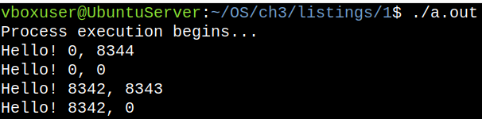
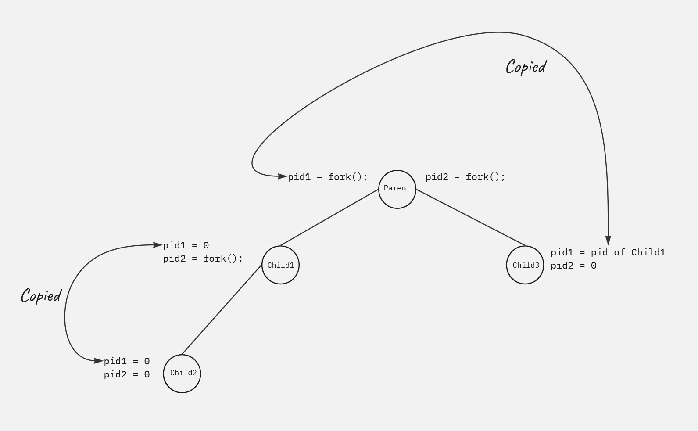

# The `fork()` system call

* Program: <a href="https://github.com/chaotic-Coder2002/Learning_OS/blob/OS/ch3/listings/1/thefork.c">thefork.c</a>.

After a `fork()` system call, one of the two processes typically uses the `exec()` system call to replace the process's memory space with a new program.
The `exec()` system call loads a binary file into memory (destroying the memory image of the program containing the `exec()` system call) and starts its execution. In this manner, the two processes are able to communicateand then go their separate ways.

The parentcan then create more children; or if it has nothing else to do while the child runs, it can issue a `wait()` system call to move itself off the ready queue until the termination of the child. Because the call `exec()` overlays the process's address space with a new program, the call to `exec()` doesn't return control unless an error occurs.

# More on the `fork()` system call

* Program: <a href="https://github.com/chaotic-Coder2002/Learning_OS/blob/OS/ch3/listings/1/moreforks.c">moreforks.c</a>.

This program has the following lines:

```c
puts("Process execution begins...");
pid_t pid1 = fork();
pid_t pid2 = fork();
printf("Hello! %d, %d\n", pid1, pid2);
```

and its output is:



Let's try to understand the output here.

First, only the parent process was executing (hence we see only one `Process execution begins...` in the output), let's call it `Parent`. After that, the first `fork()` occurred. After which a child process was created at `pid_t pid1 = fork();`, let's call this `Child1`. Now, both `Parent` and `Child1` continue execution after this line where `Parent` gets `Child1`'s PID which gets stored in its (`Parent`'s) `pid1` whereas the child gets a `0` which gets stored in its (`Child1`'s) `pid1`.

Now in the next line, another fork is created. At `pid_t pid2 = fork();`, both `Parent` and `Child1` create their respective children. `Child1` creates `Child2` whose PID gets stored in `Child1`'s `pid2` variable and `Child2` gets a `0` which gets stored in its `pid2` variable. And since we know that a child has a copy of the address space of the parent, so `Child2`'s `pid1` gets the value of `Child1`'s `pid1`. Similarly, `Parent` gets the PID of `Child3` which gets stored in its `pid2` and `Child3` gets `0` which gets stored in its own `pid2` variable. Now, again, because `Child3` has a copy of `Parent`'s address space, so `Child3`'s `pid1` gets the value of `Parent`'s `pid1` variable.

The same has been picturized in the following image:




# Some helpful links

* <a href="https://www.ibm.com/docs/en/zos-basic-skills?topic=storage-what-is-address-space">https://www.ibm.com/docs/en/zos-basic-skills?topic=storage-what-is-address-space</a>.
* <a href="https://www.techtarget.com/searchstorage/definition/address-space">https://www.techtarget.com/searchstorage/definition/address-space</a>.


---
